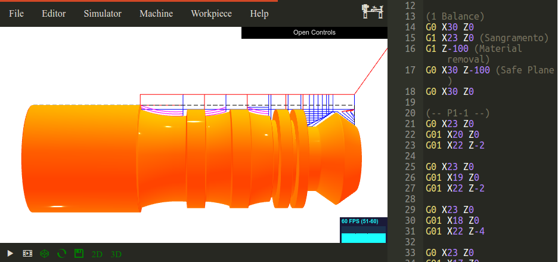

# G Code Sandbox

Estudo sobre técnicas de fabrição usando [comando númerico](https://pt.wikipedia.org/wiki/Código_G) para torno e fresa.

## Descrição das Pastas

 * [tex](tex): Código fonte dos relatórios
 * [src](src): Arquivos em Código G

## Referências
 
  * [Web CNC Simulator](https://github.com/filipecaixeta/cncwebsim)
